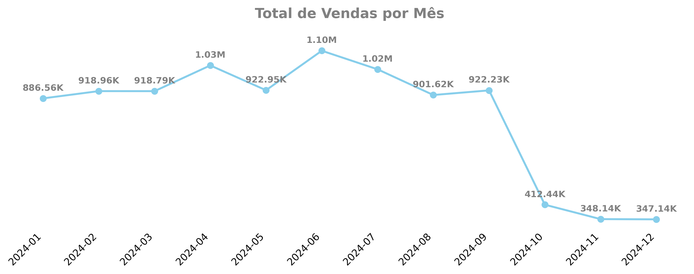
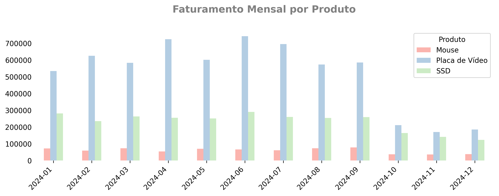

## Case de Negócio: Queda nas Vendas da HashTech

### Contexto

A **HashTech** é uma empresa de e-commerce especializada em produtos de tecnologia. Por muito tempo, a empresa vinha apresentando bons resultados com a venda de três produtos principais:

- **Placas de Vídeo**
- **SSDs**
- **Mouses**

No entanto, no último trimestre, a empresa observou uma **queda expressiva no faturamento**, mesmo mantendo o mesmo catálogo de produtos e sem alterações significativas nas campanhas de marketing. Preocupada com a situação, a diretoria acionou a equipe de Business Intelligence para **investigar as causas da queda nas vendas** e propor **hipóteses que embasem futuras ações estratégicas**.

---

### Objetivo

O objetivo deste projeto é investigar os dados históricos de vendas da HashTech para:

- Identificar **quando** ocorreu a queda no faturamento
- Detectar **o que mudou** no período (preço, volume, produto, canal, etc)
- Levantar **hipóteses plausíveis** para explicar a queda

---

### Organização do Projeto

```text
📦 dataviz_hashtech_salesdrop/
├── data/         # Base de dados fictícia utilizada na análise
├── scripts/      # Scripts de análise e geração de visualizações (R e Python)
├── plots/        # Imagens geradas durante a análise (gráficos)
├── README.md     # Documentação principal do projeto
```
---

### Base de Dados

A análise é baseada em uma base fictícia de vendas com os seguintes campos:

| data       | produto         | preco_unitario | quantidade | canal_venda | cidade         |
|------------|------------------|----------------|------------|-------------|----------------|
| 2024-01-15 | SSD              | 300            | 5          | Online      | São Paulo      |
| 2024-02-01 | Placa de Vídeo   | 2000           | 3          | Marketplace | Belo Horizonte |
| 2024-02-12 | Mouse            | 80             | 10         | Online      | Salvador       |

---

### Análises Realizadas

- Evolução mensal do **faturamento total** da empresa
- Avaliação do faturamento por produto
- Análise de **preço médio** por produto ao longo do tempo.

---

### Conclusões

- **Quando a queda começou?**  O faturamento começou a cair no mês de **outubro**
  


- **O que mudou?**  O **preço médio** da **Placa de Vídeo** (produto de maior ticket) começou a subir significativamente a partir de outubro



- **Hipóteses levantadas:**  
  - O aumento do preço da **Placa de Vídeo** impactou negativamente seu volume de vendas.  
  - Embora **Mouse** e **SSD** também tenham sofrido quedas, o impacto maior veio da **Placa de Vídeo**, produto que é o principal responsável pelo faturamento

---

### Tecnologias Utilizadas

- `R` / `ggplot2` / `dplyr`
- `Python` / `Matplotlib` / `Pandas`
- Visualizações com gráficos de linha e barras
